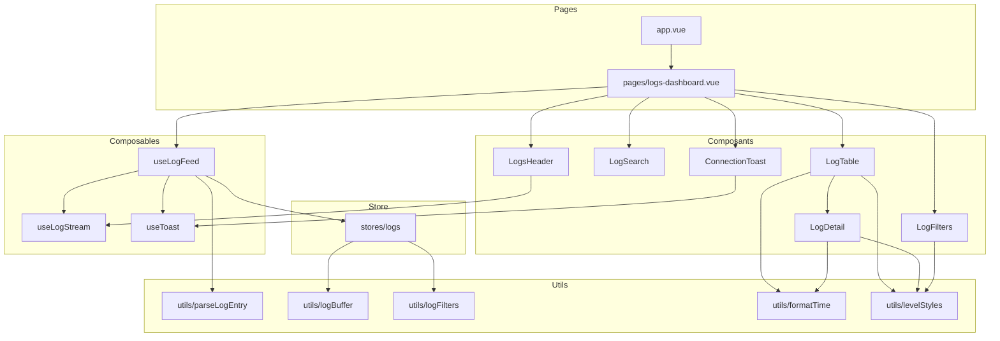

# Tableau de bord des logs

Vue temps réel du flux SSE servi par `https://technical-exercise.dyneo.io/logs/stream`.
Les entrées arrivent les plus récentes en tête, peuvent être filtrées par niveau, recherchées
sur le message / le service et les métadonnées.

## Prérequis

- **Node.js**: v24
- **npm**: v11

## Lancement du projet

- Installation des dépendances: `npm install`
- Lancement du serveur de dev: `npm run dev`

## Commandes

- build: `npm run build`
- tests: `npm run test`
- lint: `npm run lint`

## Choix techniques

### Utilisation de typescript

- Detection d'erreur à la transpilation plutot qu'en production.
- Meilleur développeur expérience

### typia comme validateur

- Typia créé un validateur lors de la transpilation qui sera utilisée au runtime pour s'assurer qu'on manipule ce qui
  était attendu.
- Semblable à Zod mais moins verbeux et plus rapide.
- Couplé à Typescript, on a une application robuste.

### Store Pinia plutôt que `useState`

- Permet de créer un store qui
  `app/stores/logs.ts` détient l'état partagé (buffer, `Set` de déduplication, niveaux actifs,
  requête, sélection, pause) et la logique dérivée contrairement au `useState` qui n'est qu'une ref globale.

### Filtrage uniquement local

Le niveau et la recherche sont appliqués côté client (`app/utils/logFilters.ts`).

- Pour changer un queryparams, il faut fermer/rouvrir la connexion SSE
- C'est moins readable / maintenable que de faire le filtrage local
- ( ! ) Compromis qui est fait pour l'exercice. Si réel besoin de performance, c'est tout à fait possible

## Architecture

